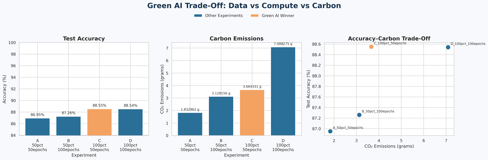

# Green AI Trade-Off: Data vs. Compute vs. Carbon

## Project overview

This project investigates how dataset size and training duration affect model accuracy and estimated carbon emissions. A deep multilayer perceptron (MLP) was trained on the Fashion-MNIST computer-vision dataset under four configurations.

## Experiment matrix

| Experiment | Training data | Epochs |
|---|---:|---:|
| A | 50% | 50 |
| B | 50% | 100 |
| C | 100% | 50 |
| D | 100% | 100 |

Every experiment used a newly initialized model so that the comparison remained fair.

## Model architecture

The model used the following architecture:

- Input: 28 x 28 grayscale Fashion-MNIST image
- One `Flatten` layer
- Five hidden `Dense` layers with 256, 128, 64, 32, and 16 units
- ReLU activation in every hidden layer
- Ten-class Softmax output layer
- Adam optimizer
- Sparse categorical cross-entropy loss
- Batch size: 128

Early stopping was not used because the purpose of the experiment was to measure the full resource cost of 50 versus 100 training epochs.

## Carbon tracking

CodeCarbon was used to estimate the carbon emissions produced during each training run. The reported emissions are estimates in grams of CO2.

## Results

| Experiment | Training data | Epochs | Test accuracy | CO2 emissions |
|---|---:|---:|---:|---:|
| A | 50% | 50 | 86.95% | 1.832962 g |
| B | 50% | 100 | 87.26% | 3.128156 g |
| C | 100% | 50 | **88.55%** | **3.664331 g** |
| D | 100% | 100 | 88.54% | 7.088275 g |

## Visualization

## Analysis

### Did doubling the dataset double accuracy or emissions?

At 50 epochs, increasing the training data from 50% to 100% raised test accuracy from 86.95% to 88.55%, an improvement of only 1.60 percentage points. Estimated emissions increased from 1.832962 g to 3.664331 g, which was approximately double.

At 100 epochs, increasing the data from 50% to 100% raised accuracy from 87.26% to 88.54%, an improvement of 1.28 percentage points. Emissions increased from 3.128156 g to 7.088275 g, an increase of approximately 126.6%.

Doubling the data therefore did not double accuracy. It produced a modest accuracy improvement while substantially increasing estimated emissions.

### Did increasing training from 50 to 100 epochs help?

With 50% of the data, increasing training from 50 to 100 epochs improved accuracy by only 0.31 percentage points, while emissions increased by approximately 70.7%.

With 100% of the data, increasing training from 50 to 100 epochs reduced accuracy by 0.01 percentage points, while emissions increased by approximately 93.4%. The additional 50 epochs therefore provided no meaningful accuracy benefit and nearly doubled the environmental cost.

### Which configuration should be deployed?

**Experiment C (100% data and 50 epochs) is the recommended deployment configuration.** It achieved the highest measured test accuracy, 88.55%, with estimated emissions of 3.664331 g. Experiment D consumed almost twice as much carbon while producing no accuracy improvement.

The selection rule treats experiments within one percentage point of the highest accuracy as having comparable predictive performance, then favors the configuration with lower carbon emissions.

## Conclusion

More training did not automatically produce a better model. Using the full dataset improved predictive accuracy, but extending training from 50 to 100 epochs added substantial environmental cost without improving performance. Experiment C provides the best balance among accuracy, compute, and carbon impact and is therefore the Green AI winner.

